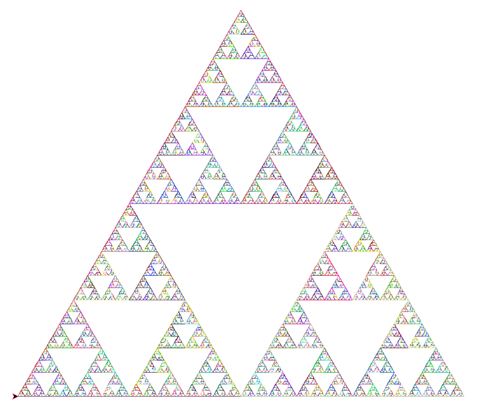

ین تصویر که حاوی مثلث های تو در تو است با استفاده از توابع بازگشتی ساخته شده است این تابع شامل یک شرط برای خروج از حلقه و چند خط کد که به طور متوالی تکرار میشوند، است . 

[فرکتال مربع](https://zahrafayazi.github.io/post-square/)
[درخت](https://zahrafayazi.github.io/post-tree/)