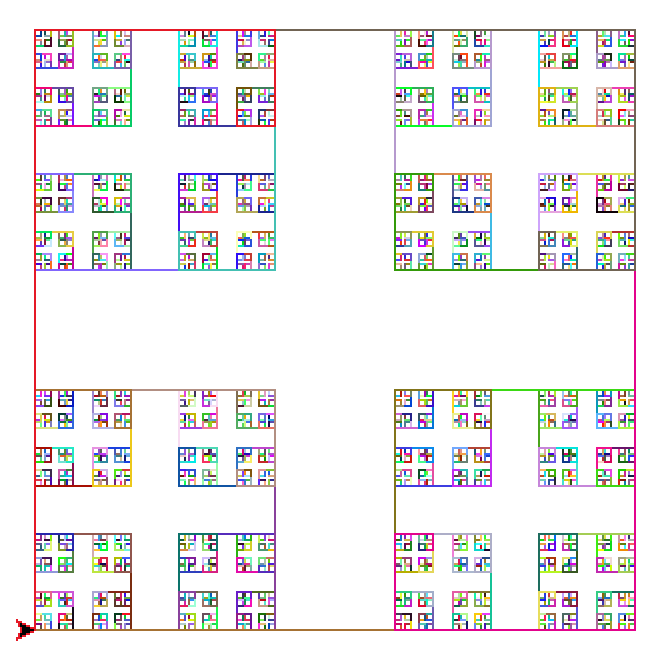
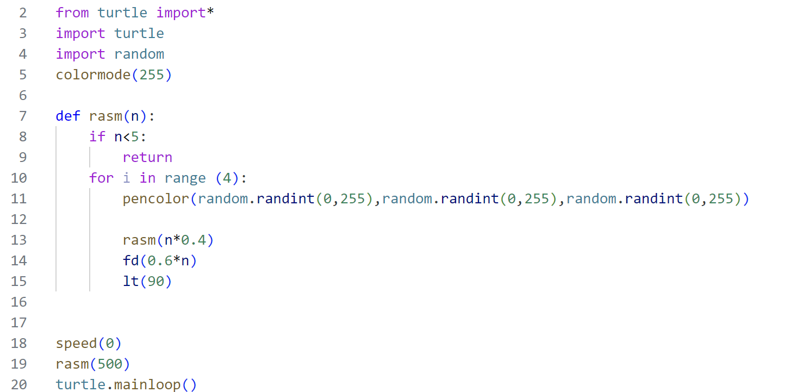

این تصویر که حاوی مربع های تو در تو است با استفاده از توابع بازگشتی ساخته شده است .این تابع شامل یک شرط برای خروج از حلقه و چند خط کد که به طور متوالی تکرار میشوند، است همچنین رنگ هر پاره خط به صورت رندوم در هر مرحله انتخاب می شود.

کد پایتون این فرکتال به شکل زیر است:

---

[فرکتال مثلث](https://zahrafayazi.github.io/post-triangle/)

[درخت](https://zahrafayazi.github.io/post-tree/)