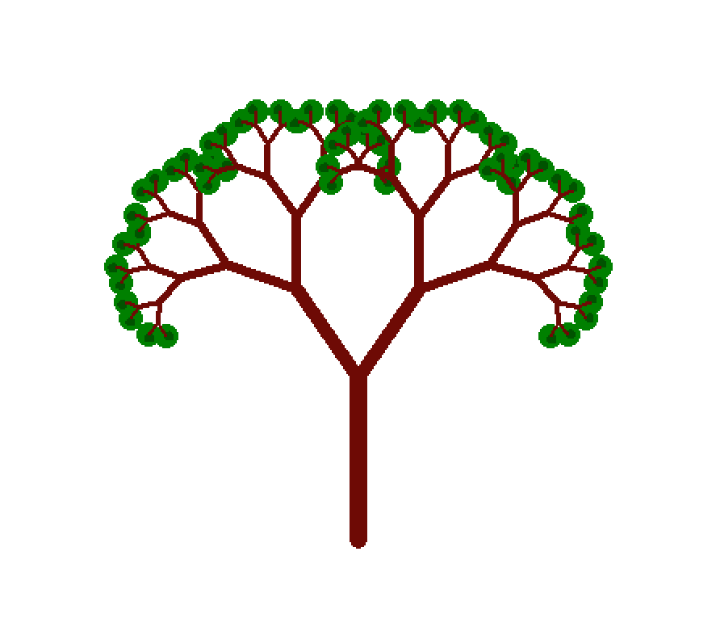
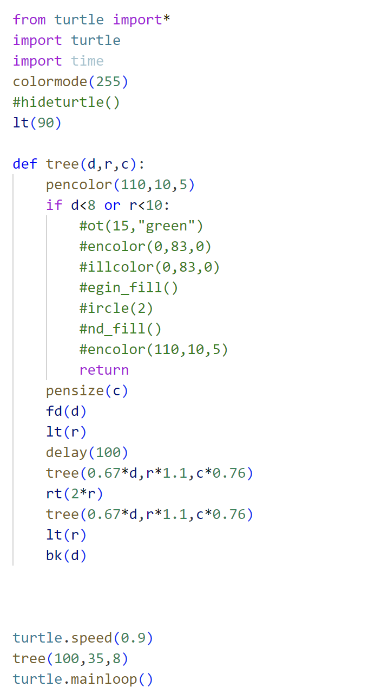

تصویر این درخت با استفاده از توابع بازگشتی و با انتخاب زاویه مناسب بین شاخه ها ساخته شده است این تابع طول شاخه ی اصلی ، ضخامت و زاویه را دریافت کرده و با استفاده از آنها درختی رسم میکند همچنین تابع دارای شرطی است که اگر طول شاخه از مقادی کمتر شود ، حلقه شکسته میشود.

کد پایتون این فرکتال به شکل زیر است:

---

[فرکتال مربع](https://zahrafayazi.github.io/post-square/)

[فرکتال مثلث](https://zahrafayazi.github.io/post-triangle/)